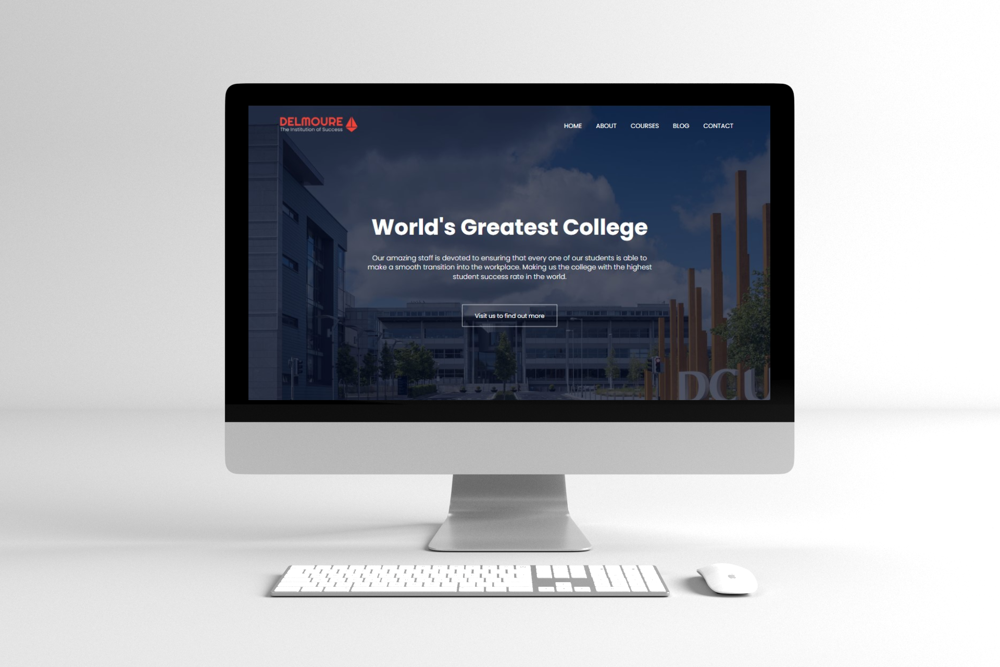
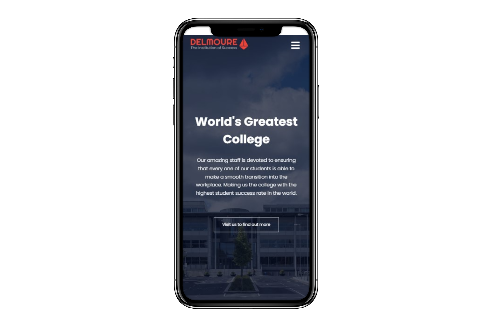
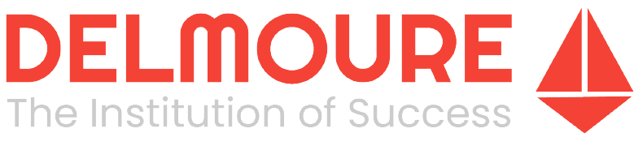

# Delmoure College (Mock) Website

**Version 1.0.0**

## Table of Contents
[Description](#Description)
[Technologies](#Technologies)
[Workflow](#Workflow)
[Author](#Author)
[License](#License-&-Copyright)

---
## Description

A responsive, mock college website made from scratch using vanilla HTML5, CSS, and JavaScript; with proper semantics, good front-end practices, and a great design. 

#### Inspiration

Always having been interested in graphic design, UI design, UX design, and with the creation of digital products, I always felt like web development was something I wanted to try. Creating websites just seemed really fun and cool. However, it involved a vast array of technologies and was extremely confusing, especially for a beginner developer like myself. 

Thus, I decided to create a mock website in which I used nothing more than plain old HTML, CSS, and JavaScript. Having an already strong understanding with these technologies (through past projects) I was using this project as a means to solidify my undertanding of front-end development and really help me prove my skills in it as well.

#### Idea

Initially, I decided what kind of website I would create. I wanted something that would really push me to learn more about the front-end, was professional, showcased my front-end capabilities and was visually appealing as well. After looking through various bank, social media, news, university and college websites, I decided that a university/collge website would be the best choice to purely showcase my front-end skills, as it was not too back-end heavy but still required an immaculate looking front-end. Thus, "Delmoure College" was born.

My focus for this project was to ensure the website was responsive, accessible on mutliple browsers and followed good front-end coding practices. This involved an extensive amount of research and learning on my part. In the end, I was able to 

#### Final Mockups

---
## Technologies

The creation of this site involved the use of various technologies, including:

- HTML5 (HyperText Markup Language)
- CSS (Cascading Style Sheets)
- JS (JavaScript)
- PHP (Hypertext Preprocessor)
- Bootstrap v5.0 
- Adobe Illustrator
- Adobe Photoshop

It involved the use of various plugins as well, including:

- Google Fonts
- Google Maps
- Font Awesome 6
- FormSubmit

---
# Workflow

My first action was to create a colour palette that would fit the college website and I decided to go with complementary colours blue and orange as the base colours for my colour palette. 

I then quickly headed over to work on my logo in Adobe Illustrator and came up with the following:

I then planned out my design, using design elements from other websites as well as some of my own. A great rule for designing the user experience of a website is to follow design patterns that are already popular, as this creates the navigation of your website easy for the user.

Once my website was designed, I moved on to coding it. Starting off with the 'Home' page and then moving on to the other pages. My workflow consisted of creating each section of the webpage with HTML first, then beautifying it and adding animations using CSS. I utilized JavaScript and Bootstrap defined break points along with media queries to make the website fully responsive.

---
## Author

- Muhammad Ahmed (4zad) <mahmed224@myseneca.ca>

---
## License & Copyright

Copyright &copy 2021 Muhammad Ahmed (4zad).
All rights reserved.

